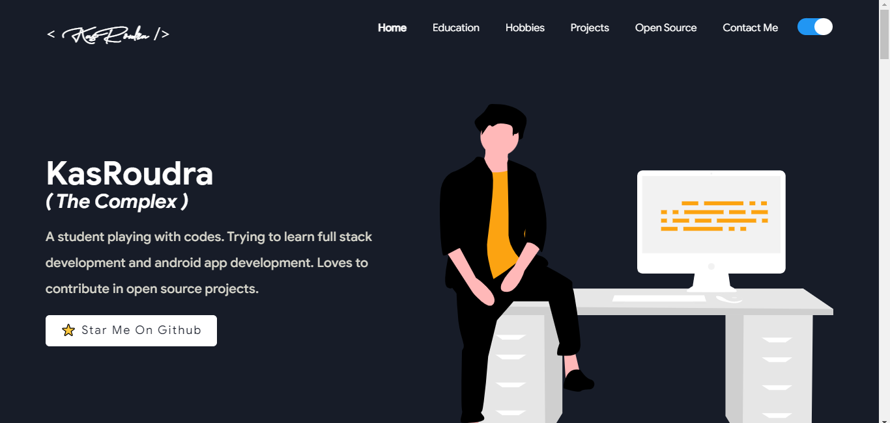

<h1 align="center">SupremeFolio</h1>

<p align="center"> 
    
</p>

<div align="center">

<!-- ![Stars]https://img.shields.io/github/stars/KasRoudra/supremeFolio?style=for-the-badge&color=orange">
  
  
  
<br>
<br>
-->

[](https://nodejs.org/en/blog/release/v17.6.0/)
[](https://www.npmjs.com/package/npm/v/8.5.1)
[](https://reactjs.org/)
[](https://github.com/KasRoudra)
[](./LICENSE)
[](https://www.javascript.com)
[](https://github.com/KasRoudra/supremeFolio/commits/main)
[](https://kasroudra.github.io)

</div>

### Light Mode


### Dark Mode



## [~] Description :

**_A clean, beautiful, responsive and 100% customizable portfolio template for Software Developers! Beautify your portfolio to the peak!_**

## [~] Quick Guide

#### Install primary dependencies (git and nodejs)

- For Debian
  - `sudo apt install git nodejs -y`
- For Arch
  - `sudo pacman -S git nodejs --noconfirm`
- For Fedora
  - `sudo yum install git nodejs -y`
- For Termux
  - `pkg install git nodejs -y`

#### Clone this repository

- `git clone https://github.com/KasRoudra/supremeFolio`

#### Enter the directory

- `cd supremeFolio`

#### Install npm dependencies

- `npm i`

#### SetUp Portfolio

- **Just tweak `src/portfolio.js`**

#### Start local server in port 3000

- `npm start`

#### Docker Commands

```
1) BUILD IMAGE : docker build -t supremeFolio:latest .
2) RUN IMAGE: docker run -t -p 3000:3000 supremeFolio:latest
```

Now preview your site in [http://localhost:3000](http://localhost:3000)

### [☆]Features:

- Show your github open source contributions(pull requests and issues)
- Display your pinned projects of github and publications
- Enrich your portfolio with skills and skillbars
- Easy to tweak
- Support for environment variable or hardcoded values
- Show your achivements and certifications
- Display your experiences
- Dark Mode
- Multiple themes

## [★]Documentation

#### Sections 📚

✔️ Summary and About me\
✔️ Skills \
✔️ Your Own Projects \
✔️ Open Source Projects Connected with Github\
✔️ Experience\
✔️ Certifications 🏆\
✔️ Blogs(live from medium or hardcoded)\
✔️ Talks\
✔️ PodCasts\
✔️ Twitter Tweets\
✔️ Education\
✔️ Contact me

To view a live example, **[click here](https://KasRoudra.github.io/)**

#### Clone And Use 📋

- The website is completely built on `react-js` library of `javascript` and that's why we need `nodejs` and `npm` installed.
- While installing `nodejs`, `npm` should be installed automatically. Try to install versions which are equal or greater than the versions mentioned in badges above.
- After the successful installation of `nodejs` clone the repository into your local system using below command:
  - ```bash
     git clone https://github.com/KasRoudra/supremeFolio.git
    ```
  - This will clone the whole repository in your system.
- To download required dependencies to your system, navigate to the directory where the cloned repository resides and execute following command:
  - ```node
    npm install
    ```
- Now, the project is ready to use.
- You can check it using `npm start`, it will open the website locally on your browser.

### Customize it to make your own portfolio ✏️

In this project, there are basically 4 things that you need to change to customize this to anyone else's portfolio: **package.json**, **Personal Information**, **Github Information** and **Splash Logo**.

#### package.json

Open this file, which is in the main cloned directory. Choose any "name". If you are publishing website in github you need to change the value of `homepage` from `https://kasroudra.github.io/` to `https://<your-github-username>.github.io/`. Do not forget the `https://` or the last `/`, otherwise fonts will not load. If you are using any other hosting service, use that url in `homepage`.

### Personal Information

You will find `src/portfolio.js` file which contains the complete information about the user. The file looks something like below:

```javascript
// Home Page
const greeting = {
    ...
}

// Social Media
const socialMediaLinks = {
    ...
}

...
```

You can change the personal information, experience, education, social media, certifications, blog information, contact information, podcasts, talks etc. in `src/portfolio.js` to directly reflect them in portfolio website.

### Github Information and blogs

You need to use your github username and a github token to fetch and show your information about opensource contributions. Your medium username is required to fetch medium blogs.

You can get a github token as described [here](https://docs.github.com/en/github/authenticating-to-github/creating-a-personal-access-token). The token we need, requires no permission. So you don't need to check any box while generating token. But make sure your token do not expire very soon.

Now, you've 2 options.

- If you are using [vercel](https://vercel.com) or [netlify](https://netlify.com) or similar site for your site's build, you can use environment variables. That environment variables are `GITHUB_TOKEN` and `GITHUB_USERNAME` and `MEDIUM_USERNAME`. You can also use environment variables locally. You need to create a .env file or use our template by `cp env.example .env`. Then apply your username and token in that.

```env
GITHUB_TOKEN = "YOUR GITHUB TOKEN HERE"
GITHUB_USERNAME = "YOUR GITHUB USERNAME HERE"
MEDIUM_USERNAME = "YOUR MEDIUM USERNAME HERE"
```

- You will find `fetcher.mjs` file in the main directory of the repository. This file is used to fetch the data (Pull requests, Issues, Organizations, Pinned projects etc.) from your github.
  If you open the file, you will see below component at the top of the file. You need to change only that component.

```javascript
var githubConvertedToken: "Your Github Token Here.",
var githubUserName: "Your Github Username Here.",
var mediumUserName = "Your Medium Username Here";
```

If you are only using static builds and do not contribute frequently in github you can use your name and tokens directly in `fetcher.mjs`.

```node
node fetcher.mjs
```

**Warning:** Treat your tokens like passwords and keep them secret. When working with the API, use tokens as environment variables instead of hardcoding them into your programs. If you've used your token in `fetcher.mjs` make sure not to upload that.

This will fetch all the data from your github and medium and it will automatically replace my data with yours.
Whenever you want to update the github related information on the website you need to run this command.

Note: Github Projects section only show pinned items of your GitHub.
If you are seeing something as shown below, follow these [instructions](https://docs.github.com/en/enterprise/2.13/user/articles/pinning-items-to-your-profile).


If the above solution still doesn't work, visit the [wiki page](https://github.com/saadpasta/developerFolio/wiki/Github-Setup-For-Open-Source-Projects).

### Splash Logo

Note here that if you click [my portfolio](https://KasRoudra.github.io), you can see animated loading at the beginning. That is collected from developerFolio. This loading screen is universal and you can use it. But if you want to change it, you have below two alternatives:

- If you want to design your own logo, then you can design it using `Figma` or `Adobe XD` or `Adobe Illustrator` or `Inkscape`. If you want to animate it, you can refer to `./src/components/Loader` directory which contains `js` and `css` files which animates the logo. You should set `useLottie` to false in case you do so. Also if you want some prebuilt animations you can download that from [lotti](https://lottiefiles.com/featured) and place them in `src/assets/lottie` folder. Then set the filename in `portfolio.js` and enable `useLottie`. That's it!

- If you don't want Splash screen or you don't know how to design logo, then this option is for you.

  - You can open `src/portfolio.js` file and at the top of this file you will see `pageEnabled` component as below:
  - ```javascript
    // Website related settings
    const pageEnabled = {
      splash: true,
    };
    ```
  - Change `splash` from `true` to `false`.
  - Now, if you see your website using `npm start`, it will directly open `home` rather than animating logo `splash` screen.
  - If you design your logo in future, then edit the files in `./src/components/Loader` and then revert `splash` to `true` and `useLottie` to `false` in `src/portfolio.js`.

### Other

- You need to change the website title and other descriptions in `public/index.html`

- You can define your own favicon in `public/icons` directory. If you don't have a favicon, you can generate favicons from [Favicon Generator](https://www.favicon-generator.org/) and [Favicon IO](https://favicon.io/)

- Also you can edit your website preview known as description image. Run your site locally, take a screenshot and replace with `public/icons/desc.png`. Note that your screenshot should be 1280x640 for better preview

### Choose Theme 🌈

- You can take a look at `src/theme.js` file where all available themes are mentioned with respective color codes.
- At the bottom of this file you will see the below code:
  - `const Theme = blueTheme;`
  - You need to change the name from `Theme` to whatever theme you want to set your website to.
  - You can also change the values in `darkTheme` to change dark mode colors.
  - You can define new theme similarly as other themes and you can assign name of that new defined theme to `Theme`.
- That's it. You just need to change the theme name and the code will take care of everything else.

  Run `npm start` to check if everything is ok.

### Deployment 📦

- Once you are done with your setup and have successfully completed all steps above, you need to put your website online!
- I highly recommend using [Github Pages](https://create-react-app.dev/docs/deployment/#github-pages) to achieve this the EASIEST WAY.
- To deploy your website, you have two options. First you need to create a github repository with the name `<your-github-username>.github.io`. Please don't give it any other name.
- Now, you need to generate a production build and deploy the website.

**Option 1:**

- Run `npm run build` to generate the production build folder.
- Enter the build folder, `git init` and push the generated code to the `main/master` branch of your new repository. That's it. Done.
  You may need to `git init` and force push at every new build.

**Option 2 (will not work with [user pages](https://docs.github.com/en/github/working-with-github-pages/about-github-pages)):**

- Run `npm run deploy` to build and create a branch called `gh-pages`. It will push the `build` files to that branch.
- The last step in deploying is to enable `Github Pages` in settings of the repository and select `gh-pages` branch.

Now, your website is successfully deployed and you can visit it at `<your-github-username>.github.io`.

**Option 3**

- Create a repository in github/gitlab/bitbucket.
- Commit and push the source code to that repository. Then connect your github/gitlab/bitbucket account with [vercel](https://vercel.com) or [netlify](https://netlify.com).
- Choose that repository from vercel or netlify. Use their services to build and publish your site. I prefer this more because in this method our changes in source code and commit and push results in live changes of wesbite without manual build.

#### Deploying to Netlify

You could also host directly with Netlify by linking your own repository.

[](https://app.netlify.com/start/deploy?repository=https://github.com/KasRoudra/supremeFolio)

For more information, read [hosting on Netlify](https://create-react-app.dev/docs/deployment/#netlify).

#### Deploying to Vercel

[](https://vercel.com/import/project?template=https://github.com/KasRoudra/supremeFolio)

For more information, read [hosting on vercel](https://create-react-app.dev/docs/deployment/#vercel).

#### Deploying to Heroku

[](https://www.heroku.com/deploy/?template=https://github.com/KasRoudra/supremeFolio)

For more information, read [hosting on heroku](https://create-react-app.dev/docs/deployment/#heroku).

#### Extended

- If you want to assign a custom domain of your portfolio, buy a domain and follow this [instruction](https://docs.github.com/en/pages/configuring-a-custom-domain-for-your-github-pages-site) for github pages.
- If you are not deploying website in github you can set `Router` in `src/portfolio.js` to `BrowserRouter` to avoid `#` in page url.

### Technologies used 🛠️

- [React](https://reactjs.org/)
- [graphql](https://graphql.org/)
- [react-twitter-embed](https://github.com/saurabhnemade/react-twitter-embed)
- [bootstrap](https://getbootstrap.com)
- [fontawesome](https://fontawesome.io)
- [apollo-boost](https://www.apollographql.com/docs/react/get-started/)
- [baseui](https://github.com/uber/baseweb)
- [react-reveal](https://www.react-reveal.com/)
- [styled-components](https://styled-components.com/)
- [emailjs](https://emailjs.com)
- [chartjs](https://chartjs.org)

### License 📄

This project is licensed under the MIT License - see the [LICENSE.md](./LICENSE) file for details.

### Contributing 💡

If you can help us with these, please don't hesitate to open an [pull request](https://github.com/Kasroudra/supremeFolio/pulls) or [issue](https://github.com/KasRoudra/supremeFolio/issues).

#### This repository is open source to help others. So if you wish to copy, consider giving credit!

## Credits:

This project is based on [masterPortfolio](https://github.com/ashutosh1919/masterPortfolio) and some implementations are from [developerFolio](https://github.com/saadpasta/developerFolio)

## [~] Find Me on :

- [](https://github.com/KasRoudra)

- [](mailto:kasroudrakrd@gmail.com)

- [](https://facebook.com/KasRoudra)

- [](https://m.me/KasRoudra)

[]()
